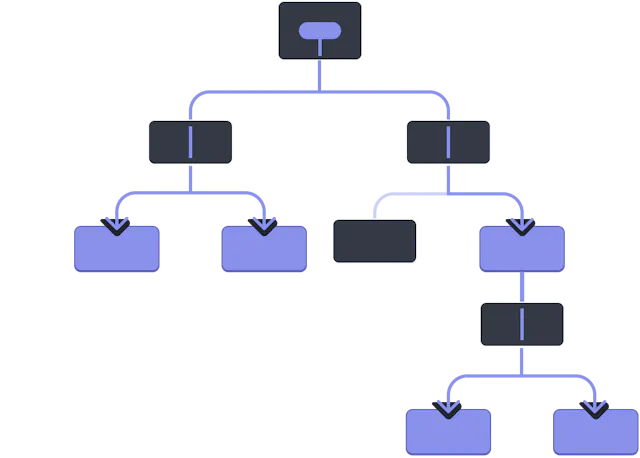
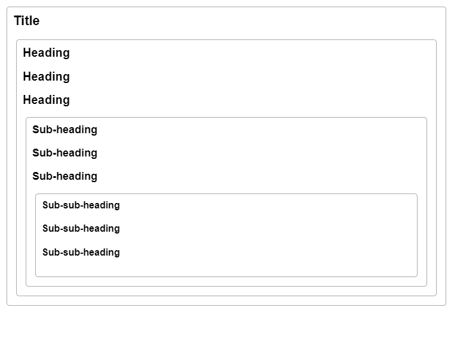

# ContextApi

Passing Data Deeply with Context
Usually, you will pass information from a parent component to a child component via props. But passing props can become verbose and inconvenient if you have to pass them through many components in the middle, or if many components in your app need the same information. Context lets the parent component make some information available to any component in the tree below it—no matter how deep—without passing it explicitly through props.

The problem with passing props 
Passing props is a great way to explicitly pipe data through your UI tree to the components that use it.

But passing props can become verbose and inconvenient when you need to pass some prop deeply through the tree, or if many components need the same prop. The nearest common ancestor could be far removed from the components that need data, and lifting state up that high can lead to a situation called “prop drilling”.




so how to fix this , like putting props to every component would be pain

## Example

```javascript
import Heading from './Heading.js';
import Section from './Section.js';

export default function Page() {
  return (
    <Section>
      <Heading level={1}>Title</Heading>
      <Section>
        <Heading level={2}>Heading</Heading>
        <Heading level={2}>Heading</Heading>
        <Heading level={2}>Heading</Heading>
        <Section>
          <Heading level={3}>Sub-heading</Heading>
          <Heading level={3}>Sub-heading</Heading>
          <Heading level={3}>Sub-heading</Heading>
          <Section>
            <Heading level={4}>Sub-sub-heading</Heading>
            <Heading level={4}>Sub-sub-heading</Heading>
            <Heading level={4}>Sub-sub-heading</Heading>
          </Section>
        </Section>
      </Section>
    </Section>
  );
}
```
and here is the output



As we can see, in order to achive this, we needed to put prop to every Heading, what about we can just put that level = {1} in section which can be passsed down to childrens like


```javascript
<Section level={4}>
  <Heading>Sub-sub-heading</Heading>
  <Heading>Sub-sub-heading</Heading>
  <Heading>Sub-sub-heading</Heading>
</Section>
```

## Step 1 
Create a folder name context, where we will store different context
and then make context like this

```javascript
import React,{createContext} from "react";

const UserContext = createContext()

export default UserContext;

```

Context gives a Provider so the fragment parent can provide that to child
and parent becomes the provider

```javascript
<UserContext>
<User>
<Login>
<Homee>
</USerContext>
```

So, The UserContext is becoming like a global variable which User Login and Home can access the all States

## Step 2
Create the Jsx file which will act like a provider for the children components


```javascript
import React,{useState} from "react";
import UserContext from "./UserContext";

const UserContextProvider = ({children}) =>{
    const [user,setUser] = useState("")
    return(
        <UserContext.Provider value={{user,setUser}}>
            {children}
        </UserContext.Provider>
    )
}

export default UserContextProvider;
```

here we make UserContextProvider, where it takes children from the props,
where we mean is UserContext.Provider will pass down value to any children value 
here we are passing user, setUser

## Step 3
In the App.jsx, we can use this like this

```javascript
import UserContextProvider from './context/UserContextProvider'

function App() {

  return (
    <>
    <UserContextProvider>
    <Login/>
      <Profile/>
    </UserContextProvider>
    </>
  )
}

export default App
```

inside the UserContextProvieder, the children components can access the props from the UserContextProvider

## Step 4

NOW HERE, we can set the state of the user from the Login now, how?

```javascript
unction Login() {
const [username,setUsername] = useState("")
const [password,setPassword] = useState("")

const {setUser} = useContext(UserContext);

    const handleSubmit  = (e) =>{
        e.preventDefault();
        setUser({username,password})
    }

  return (
    <div>
        <h2>Login</h2>
        <input type="text"
        value={username}
        onChange={(e)=>{
            setUsername(e.target.value)
        }} placeholder='username' id="" />
        <input type="text" 
        value={password}
        onChange={(e) =>{
            setPassword(e.target.value)
        }}
        placeholder='password' id="" />
        <button onClick={handleSubmit}></button>
    </div>
  )
}

export default Login
```

See, we are taking the username and the password
and on click, we are saving it in the username and password state using setUsername and setPassword

NOW, how to change the context globally, here we then import the UserContext

and then call setUser,

then in handleSubmit, we setUser({username,password})
```javascript
const UserContextProvider = ({children}) =>{
    const [user,setUser] = useState("")
    return(
        <UserContext.Provider value={{user,setUser}}>
            {children}
        </UserContext.Provider>
    )
}
```

here we are setting setUser({username,password})

means now , in user fragment username and password can be accessable and their state will change globally of the fragment

## STEP 5
HERE THINGS WILL GET CLEAR
1
```javascript
const UserContext = createContext()
```
```javascript
2. 
const UserContextProvider = ({children}) =>{
    const [user,setUser] = useState("") // the user here
    return(
        <UserContext.Provider value={{user,setUser}}>
            {children}
        </UserContext.Provider>
    )
}

```
3.
```javascript
const [username,setUsername] = useState("")
const [password,setPassword] = useState("")

const {setUser} = useContext(UserContext);

    const handleSubmit  = (e) =>{
        e.preventDefault();
        setUser({username,password})
    }

```
here we took setUser now,and now 
### _________________
user will become JSON File in which we will have username and password
### _________________
and that can be accessed anywhere(within the fragment)


## STEP 6

now in Login, we can see
```javascript
function Profile() {
    const {user} = useContext(UserContext);
    if(!user) return <div>Please Login</div>

    return <div>Welcome {user.username}{user.password}</div>
}

export default Profile
```

we can see we got user here and then using user.username and user.password, so if i make any changes to the username there, it will reflect in this component as well

so, we didnt need to pass the props again and again(which is called prop drill)
